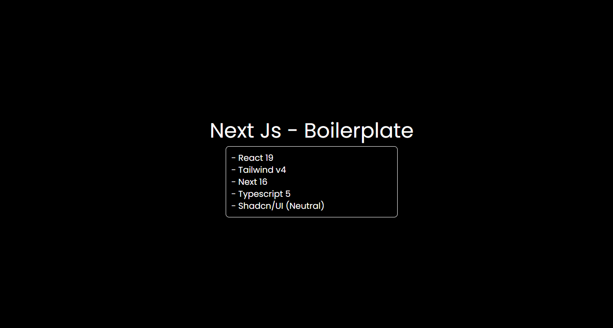

## 🚀 NextJs + Typescript - Boilerplate

A **ready-to-use Next.js boilerplate** built with modern best practices.  
Designed for day-to-day projects like **Website Building, Single-Page Application, SaaS App, etc.**.



### 🧱 Tech Stack

- **React 19**
- **Next.js 16** (App Router)
- **Tailwind 4**
- **Typescript 5**
- **Font - Poppins**
- **Shadcn/UI - Neutral**
- **React Icons v5.5**
- Custom Hooks

## 📁 Project Structure

```
next-js-boilerplate/
|
├── app/ # Next.js App Router
| |
| ├── favicon.ico
| ├── globals.css
│ ├── layout.tsx
│ └── page.tsx
|
├── hooks/ # Custom reusable hooks
| |
│ ├── index.tsx
│ ├── useBrowserStorage.tsx
│ ├── useIsMobile.tsx
│ └── useOnlineStatus.tsx
|
├── lib/ # API & external helpers
│ ├── constants.ts
│ └── utils.ts
|
├── public/ # Assets & Images
|
├── types/ # Global TypeScript types
| |
│ └── index.ts
|
├── .gitignore
├── components.json
├── eslint.config.mjs
├── next-env.d.ts
├── next.config.ts
├── package-lock.json
├── package.json
├── postcss.config.mjs
├── README.md
└── tsconfig.json
```

## 🧠 Included Hooks

| Hook | Description |
|----|------------|
| `useBrowserStorage` | Safe local & session storage access |
| `useIsMobile` | Viewport-based mobile detection |
| `useOnlineStatus` | To check Online/Offline status |

## ⚙️ Scripts to run the app

```bash
git clone https://github.com/Nikhil1602/next-js-boilerplate.git
cd next-js-boilerplate
npm run dev
```